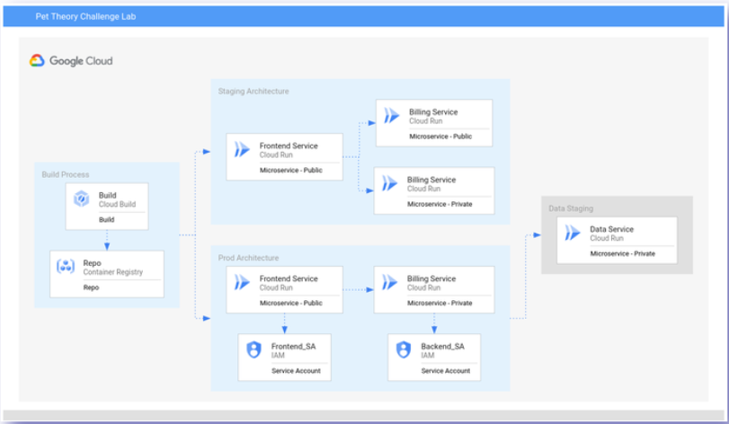
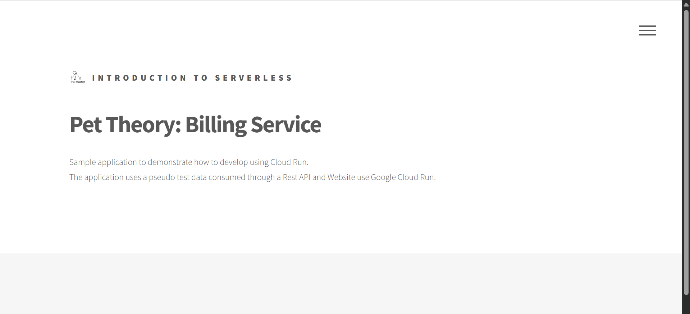

# ☁️ Develop Serverless Applications on Cloud Run

**Rute:** Rute 1 — Web Backend & Serverless
**Topik:** Cloud Run, Cloud Build, Container Registry, IAM Service Accounts
**Tanggal Pengerjaan:** 18 Januari 2026

---

## 🎯 1. Overview & Tujuan

Lab ini bertujuan untuk membangun arsitektur aplikasi *microservices* (Frontend & Backend) yang berjalan di atas **Cloud Run** (Serverless).

**Misi Utama:**

1. Membangun Container Image menggunakan **Cloud Build**.
2. Men-deploy layanan Public (Frontend) dan Private (Billing) di Cloud Run.
3. Mengamankan komunikasi antar-service menggunakan **Service Account** dan IAM Authentication (OIDC Token).

---

## 🛠️ 2. Langkah-Langkah & Solusi

### 🔹 Persiapan (Set Region)

*(Penting: Set region sesuai yang diminta di panel lab sebelah kiri)*

```bash
export REGION=us-east4
gcloud config set run/region $REGION

```

### 🔹 Task 1: Enable a Public Service (Billing Staging)

* **Deskripsi:** Membangun image untuk layanan Billing dan men-deploynya agar bisa diakses publik.
* **Perintah CLI:**

```bash
# 1. Clone Repo & Masuk Folder
git clone https://github.com/rosera/pet-theory.git
cd pet-theory/lab07/unit-api-billing

# 2. Build Image
gcloud builds submit --tag gcr.io/$GOOGLE_CLOUD_PROJECT/billing-staging-api:0.1

# 3. Deploy ke Cloud Run (Public)
gcloud run deploy public-billing-service-270 \
  --image gcr.io/$GOOGLE_CLOUD_PROJECT/billing-staging-api:0.1 \
  --platform managed \
  --allow-unauthenticated \
  --region $REGION

```

### 🔹 Task 2: Deploy a Frontend Service (Staging)

* **Deskripsi:** Deploy layanan Frontend yang akan menampilkan antarmuka aplikasi.
* **Perintah CLI:**

```bash
# 1. Pindah Folder
cd ~/pet-theory/lab07/staging-frontend-billing

# 2. Build Image Frontend
gcloud builds submit --tag gcr.io/$GOOGLE_CLOUD_PROJECT/frontend-staging:0.1

# 3. Deploy Frontend (Public)
gcloud run deploy frontend-staging-service-736 \
  --image gcr.io/$GOOGLE_CLOUD_PROJECT/frontend-staging:0.1 \
  --platform managed \
  --allow-unauthenticated \
  --region $REGION

```

### 🔹 Task 3: Deploy a Private Service (Billing V2)

* **Deskripsi:** Update layanan Billing ke versi baru, hapus yang lama, dan buat versi baru menjadi **Private** (butuh otentikasi).
* **Perintah CLI:**

```bash
# 1. Pindah Folder
cd ~/pet-theory/lab07/staging-api-billing

# 2. Hapus Service Lama
gcloud run services delete public-billing-service-270 --region $REGION --quiet

# 3. Build Image V2
gcloud builds submit --tag gcr.io/$GOOGLE_CLOUD_PROJECT/billing-staging-api:0.2

# 4. Deploy Private Service (Perhatikan flag no-allow-unauthenticated)
gcloud run deploy private-billing-service-912 \
  --image gcr.io/$GOOGLE_CLOUD_PROJECT/billing-staging-api:0.2 \
  --platform managed \
  --no-allow-unauthenticated \
  --region $REGION

```

### 🔹 Task 4 & 5: Deploy Production Billing dengan Service Account

* **Deskripsi:** Membuat Service Account khusus untuk Billing Service Production agar lebih aman.
* **Perintah CLI:**

```bash
# 1. Buat Service Account
gcloud iam service-accounts create billing-service-sa-619 \
  --display-name "Billing Service Cloud Run"

# 2. Pindah Folder Production Backend
cd ~/pet-theory/lab07/prod-api-billing

# 3. Build Image Prod
gcloud builds submit --tag gcr.io/$GOOGLE_CLOUD_PROJECT/billing-prod-api:0.1

# 4. Deploy dengan Service Account (Private)
gcloud run deploy billing-prod-service-140 \
  --image gcr.io/$GOOGLE_CLOUD_PROJECT/billing-prod-api:0.1 \
  --platform managed \
  --no-allow-unauthenticated \
  --service-account billing-service-sa-619@$GOOGLE_CLOUD_PROJECT.iam.gserviceaccount.com \
  --region $REGION

```

### 🔹 Task 6 & 7: Deploy Frontend Production (Invoker)

* **Deskripsi:** Membuat Frontend Production yang memiliki izin (Invoker Role) untuk mengakses Billing Private.
* **Perintah CLI:**

```bash
# 1. Buat Service Account Frontend
gcloud iam service-accounts create frontend-service-sa-486 \
  --display-name "Billing Service Cloud Run Invoker"

# 2. Beri Izin Frontend untuk Mengakses Billing Prod
export FRONTEND_SA=frontend-service-sa-486@$GOOGLE_CLOUD_PROJECT.iam.gserviceaccount.com

gcloud run services add-iam-policy-binding billing-prod-service-140 \
  --member=serviceAccount:$FRONTEND_SA \
  --role=roles/run.invoker \
  --platform managed \
  --region $REGION

# 3. Pindah Folder & Build Image Frontend Prod
cd ~/pet-theory/lab07/prod-frontend-billing
gcloud builds submit --tag gcr.io/$GOOGLE_CLOUD_PROJECT/frontend-prod:0.1

# 4. Deploy Frontend Prod (Public, tapi pakai SA Frontend)
gcloud run deploy frontend-prod-service-638 \
  --image gcr.io/$GOOGLE_CLOUD_PROJECT/frontend-prod:0.1 \
  --platform managed \
  --allow-unauthenticated \
  --service-account $FRONTEND_SA \
  --region $REGION

```

---

## 🐛 3. Troubleshooting / Masalah yang Dihadapi

* **Error:** `FAILED_PRECONDITION: Constraint constraints/gcp.resourceLocations violated`
* **Penyebab:** Mencoba deploy ke region default (misal `us-central1`), padahal kebijakan lab membatasi ke region tertentu (misal `us-east4`).
* **Solusi:**
> Cek panel kiri lab untuk melihat "Region" yang diizinkan, lalu set ulang variabel dengan `export REGION=[REGION_LAB]`.


* **Error:** `Docker command not found` atau error saat build.
* **Penyebab:** Menjalankan perintah `gcloud builds` di folder yang salah (tidak ada Dockerfile).
* **Solusi:**
> Pastikan selalu `cd` (pindah directory) ke folder yang sesuai instruksi sebelum menjalankan perintah build.


---

## 📝 4. Catatan Penting (Key Takeaways)

Hal-hal baru yang saya pelajari dari lab ini:

* **Private vs Public Cloud Run:** Kita bisa mengunci layanan Cloud Run dengan `--no-allow-unauthenticated`. Layanan ini hanya bisa diakses oleh user/service yang punya token valid.
* **Service-to-Service Communication:** Agar Frontend bisa mengakses Backend yang private, Frontend harus "ditempeli" Service Account, dan Service Account tersebut harus diberi role `roles/run.invoker` di Backend.
* **Automation:** Menggunakan Cloud Build memudahkan pembuatan container image tanpa perlu install Docker di local/cloud shell, langsung dari source code ke Container Registry.

---

## 📸 5. Bukti Penyelesaian (Screenshot)

**Arsitektur Aplikasi:**


**Hasil Akhir Frontend Production (Berhasil Load Data Billing):**


---

[⬅️ Kembali ke Menu Utama](../README.md)