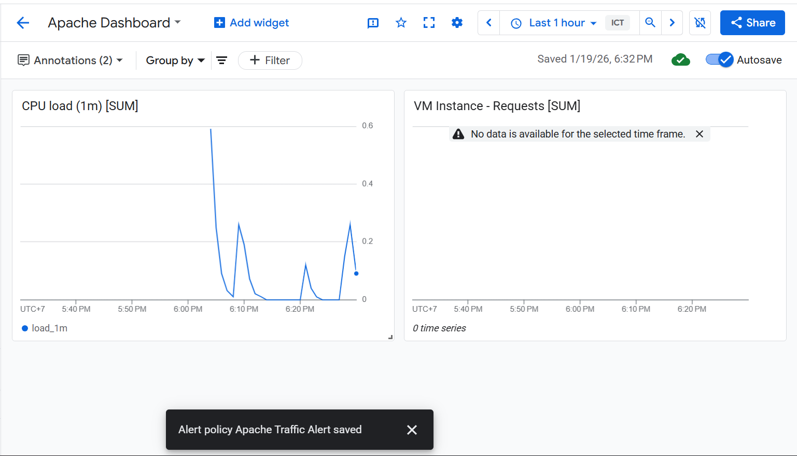
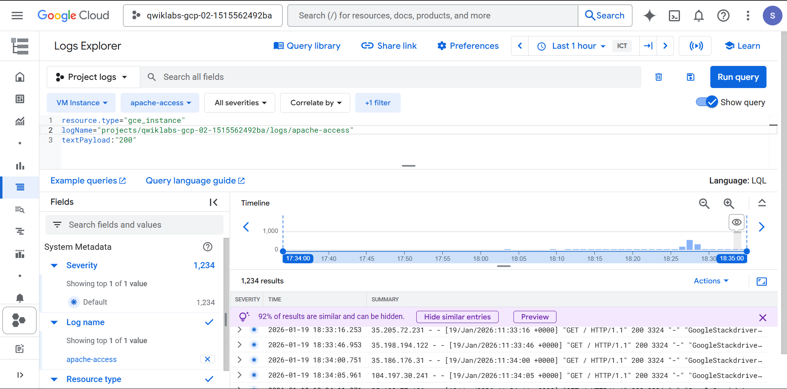

# ☁️ Monitoring in Google Cloud: Challenge Lab

**Rute:** Cloud Engineering / DevOps
**Topik:** Cloud Monitoring, Cloud Logging, Alerting, Uptime Checks, Dashboards
**Tanggal Pengerjaan:** 19 Januari 2026

---

## 🎯 1. Overview & Tujuan

Lab ini bertujuan untuk memahami cara memonitor infrastruktur (VM Apache Web Server) secara menyeluruh menggunakan Google Cloud Operations Suite. Kita diminta untuk menginstall agent legacy secara manual, memastikan server hidup (uptime), membuat notifikasi jika traffic tinggi, serta visualisasi data lewat dashboard.

**Misi Utama:**

1. Menginstall Cloud Logging & Monitoring Agent di VM.
2. Membuat Uptime Check & Alert Policy untuk trafik Apache.
3. Membuat Dashboard Visual & Log-based Metric dari log server.

---

## 🛠️ 2. Langkah-Langkah & Solusi

### 🔹 Task 1: Install Cloud Logging & Monitoring Agents

* **Deskripsi:** Menginstall agent legacy (`stackdriver-agent` dan `google-fluentd`) di VM `apache-vm` melalui SSH karena VM belum memiliki agent bawaan.
* **Perintah CLI / Script:**
*(Jalankan di Terminal SSH VM `apache-vm`)*

```bash
  # 1. Install Logging Agent
  curl -sSO https://dl.google.com/cloudagents/add-logging-agent-repo.sh
  sudo bash add-logging-agent-repo.sh --also-install

  # 2. Install Monitoring Agent
  curl -sSO https://dl.google.com/cloudagents/add-monitoring-agent-repo.sh
  sudo bash add-monitoring-agent-repo.sh --also-install

  # 3. Enable Apache Plugin (Wajib sesuai soal)
  (cd /etc/stackdriver/collectd.d/ && sudo curl -O https://raw.githubusercontent.com/Stackdriver/stackdriver-agent-service-configs/master/etc/collectd.d/apache.conf)

  # 4. Restart Agent
  sudo service stackdriver-agent restart

```

### 🔹 Task 2: Add Uptime Check

* **Deskripsi:** Memastikan Apache Web Server bisa diakses dari luar (Internet).
* **Konfigurasi GUI:**
* Menu: `Monitoring > Uptime checks > + CREATE UPTIME CHECK`
* Protocol: `HTTP`
* Resource Type: `URL`
* Hostname: `[External IP dari apache-vm]`
* Path: `/`
* Frequency: `1 minute`


### 🔹 Task 3: Add Alert Policy

* **Deskripsi:** Membuat alert email jika trafik Apache melebihi 3 KiB/s.
* **Konfigurasi GUI:**
* Menu: `Monitoring > Alerting > + CREATE POLICY`
* Select Metric: `VM Instance > Apache > Traffic` (`agent.googleapis.com/apache/traffic`)
* Threshold: `Above threshold` -> `3000` (3 KiB/s)
* Notification Channel: `[Email Student]` (Perlu refresh halaman jika tidak muncul)


* **Script Trigger Traffic (WAJIB):**
*(Jalankan di SSH VM untuk memancing alert agar centang hijau)*

```bash
  timeout 120 bash -c -- 'while true; do curl localhost | grep -oP "<title>.*</title>"; sleep .1s;done '

```

### 🔹 Task 4: Create Dashboard & Charts

* **Deskripsi:** Membuat visualisasi grafik CPU dan Request Apache.
* **Konfigurasi GUI:**
* Menu: `Monitoring > Dashboards > + CREATE DASHBOARD`
* **Widget 1 (CPU):**
* Metric: `VM Instance > Cpu > Load (1m)`
* Visual: Line Chart


* **Widget 2 (Apache):**
* Metric: `VM Instance > Apache > Requests`
* Visual: Line Chart


### 🔹 Task 5: Create Log-based Metric

* **Deskripsi:** Mengubah log text menjadi metrik angka (counter) untuk menghitung respon sukses (200 OK).
* **Konfigurasi GUI:**
* Menu: `Logging > Logs Explorer`
* Query:
```text
resource.type="gce_instance"
logName="projects/[PROJECT_ID]/logs/apache-access"
textPayload:"200"

```


* Action: Klik `Create Metric`
* Type: `Counter`
* Name: `ApacheSuccessRequests`


---

### 🐛 3. Troubleshooting / Masalah yang Dihadapi

**Error:** Notification Channel (Email) tidak muncul di dropdown saat membuat Alert Policy.

**Penyebab:** Bug UI pada Console Google Cloud yang tidak me-refresh daftar channel baru secara realtime setelah ditambahkan.

**Solusi:**

1. Tambahkan email via menu "Manage Notification Channels".
2. Kembali ke tab Alerting, lalu **Refresh Halaman Browser (F5)**.
3. Konfigurasi ulang metric dan threshold, email akan muncul.
4. Alternatif cepat via CLI: `gcloud beta monitoring channels create ...`

---

### 📝 4. Catatan Penting (Key Takeaways)

Hal-hal baru yang saya pelajari dari lab ini:

1. **Legacy Agent:** Beberapa lab masih menggunakan agent lama (`stackdriver-agent`) yang membutuhkan konfigurasi plugin manual (seperti `apache.conf`).
2. **Trigger Traffic:** Membuat Alert Policy saja tidak cukup; *checker* membutuhkan bukti bahwa alert tersebut *triggered* (menyala) dengan cara membanjiri server dengan request dummy (pakai script `curl` loop).
3. **Log-based Metric:** Sangat berguna untuk memonitor hal-hal yang tidak tertangkap oleh agent standar, hanya dengan memfilter text tertentu di logs (misal: "Error 500" atau "Success 200").

### 📸 5. Bukti Penyelesaian (Screenshot)

**Dashboard & Charts (Task 4):**



---

[⬅️ Kembali ke Menu Utama](../README.md)